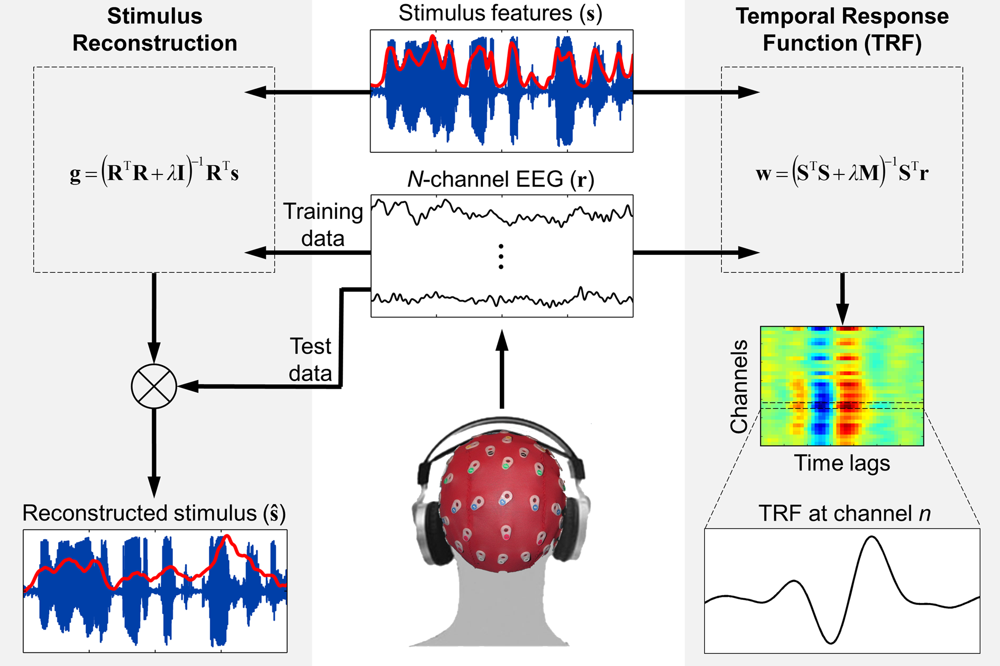

# mTRF-Toolbox
mTRF-Toolbox is a MATLAB package for fast computation of forward encoding
models (stimulus to neural response) or backward decoding models (neural
response to stimulus). It is suitable for analysing various types of multi-
channel neurophysiological data including MEG, EEG, iEEG, sEEG, ECoG and 
EMG data. Forward encoding models, also known as response functions or 
receptive fields, can be used to investigate information processing in 
neuronal populations with respect to some temporal dimension (TRFs), or 
spectro- or spatio-temporal dimensions (STRFs). TRFs can be subjected to 
conventional time-frequency and source analysis techniques used to analyse
event related potentials (ERPs). In addition, TRFs can be used to predict
the dynamics of neural responses to unseen stimulus sequences as a way to 
objectively measure information encoding. Stimulus reconstruction can be 
performed using backward decoding models that project the multi-channel 
neural responses back to the dynamics of the stimulus. mTRF-Toolbox 
facilitates the use of natural continuous stimuli in electrophysiological 
studies compared to conventional time-locked averaging approaches which 
require the use of discrete stimulus events. This allows researchers to 
investigate how neural systems process dynamic environmental signals such 
as speech, music and motion, and to decode dynamic cognitive processes such
as attention and multisensory integration.

### Documentation
Documentation on mTRF-Toolbox usage and underlying theory can be found [here](http://mickcrosse.com/assets/pubs/Crosse_etal_FrontHumNeurosci_2016.pdf).

## mTRF Modeling Framework

## Contents
### Fitting Encoding and Decoding Models
* `mTRFcrossval()` - cross-validation for tuning model hyperparameters
* `mTRFtrain()` - encoding/decoding model fitting (TRF/STRF estimation)
* `mTRFpredict()` - model prediction and evaluation
* `mTRFtransform()` - transforms decoding models into neurophysiologically interpretable encoding models
 
### Decoding Attention and Multisensory Integration
* `mTRFattncrossval()` - cross-validation for attention decoding
* `mTRFmulticrossval()` - cross-validation for additive models of multisensory processing

### Tools for Rapid Least Squares Estimation
* `lagGen()` - generates time-lagged input features
* `olscovmat()` - ordinary least squares covariance matrix estimation
* `mlscovmat()` - multisensory least squares covariance matrix estimation

## Tips on Practical Usage
* Ensure that the stimulus and response data are temporally aligned and 
  have the same sample rate and number of samples.
* Downsample the data when conducting large-scale multivariate analyses
  to reduce running time, e.g., 128 Hz or 64 Hz.
* Normalize or standardize the data beforehand. We recommend normalizing 
  by the standard deviation. This will stabalise regularization across 
  trials/subjects/groups and facilitate a smaller parameter search.
* Enter the min and max time lags in milliseconds, not seconds. Enter 
  positive lags for post-stimulus mapping and negative lags for pre-
  stimulus mapping. This applies to both forward and backward models - 
  the code will automatically reverse the lags for backward models.

## References
1. Crosse MJ, Di Liberto GM, Bednar A, Lalor EC (2016) The Multivariate Temporal Response Function (mTRF) Toolbox: A MATLAB Toolbox for Relating Neural Signals to Continuous Stimuli. Frontiers in Human Neuroscience 10:604.
2. Lalor EC, Pearlmutter BA, Reilly RB, McDarby G, Foxe JJ (2006) The VESPA: a method for the rapid estimation of a visual evoked potential. NeuroImage 32:1549-1561.
3. Gonçalves NR, Whelan R, Foxe JJ, Lalor EC (2014) Towards obtaining spatiotemporally precise responses to continuous sensory stimuli in humans: a general linear modeling approach to EEG. NeuroImage 97(2014):196-205.
4. Holdgraf CR, Rieger JW, Micheli C, Martin S, Knight RT, Theunissen FE (2017) Encoding and Decoding Models in Cognitive Electrophysiology Front Syst Neurosci 11:61.
5. Alickovic E, Lunner T, Gustafsson F, Ljung L (2019) A Tutorial on Auditory Attention Identification Methods. Front Neurosci 13:153.
6. Haufe S, Meinecke F, Gorgen K, Dahne S, Haynes JD, Blankertz B, Bießmann F (2014) On the interpretation of weight vectors of linear models in multivariate neuroimaging. NeuroImage 87:96-110.
