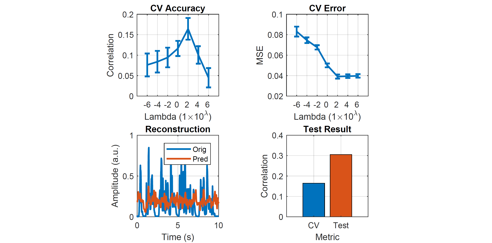

# 

[](https://opensource.org/licenses/BSD-3-Clause)
[](https://www.mathworks.com/matlabcentral/fileexchange/74260-mtrf-toolbox)
[](https://sourceforge.net/projects/aespa/files/latest/download)

mTRF-Toolbox is a MATLAB package for quantitative modelling of sensory processing, suitable for neurophysiological data such as MEG, EEG, sEEG, ECoG and EMG. It can be used to model the functional relationship between neuronal populations and dynamic sensory inputs such as natural scenes and sounds, or build neural decoders for reconstructing stimulus features and developing real-time applications such as brain-computer interfaces (BCIs).

- [Installation](#installation)
- [Documentation](#documentation)
- [mTRF Modelling Framework](#mtrf-modelling-framework)
- [Contents](#contents)
  - [Fitting Encoding and Decoding Models](#fitting-encoding-and-decoding-models)
  - [Decoding Attention and Multisensory Processing](#decoding-attention-and-multisensory-processing)
  - [Efficient Covariance Matrix Estimation](#efficient-covariance-matrix-estimation)
  - [Feature Extraction](#feature-extraction)
- [Examples](#examples)
  - [STRF Estimation](#strf-estimation)
- [License](#license)

## Installation

Download and unzip mTRF-Toolbox to a local directory, then in the MATLAB/GNU Octave command window enter:
```matlab
addpath 'directory/mTRF-Toolbox-master'
savepath
```

## Documentation

For documentation, please refer to the [mTRF-Toolbox paper](docs/Crosse_etal_FrontHumNeurosci_2016.pdf).

For code demonstrating usage, please see [mTRFdemos](mTRFdemos.m).

## mTRF Modelling Framework

mTRF-Toolbox provides a complementary forward/backward quantitative modelling framework. A forward model, known as a temporal response function or temporal receptive field (TRF), describes how sensory information is encoded in neuronal activity. Multivariate stimulus features such as spatio- or spectro-temporal representations, as well as categorical features such as phonetic or semantic embeddings, can be used as inputs to the model. TRFs can be subjected to conventional time-frequency/source analysis techniques or used to predict the neural responses to an independent set of stimuli. mTRF-Toolbox provides an efficient cross-validation procedure for hyperparameter optimization.

A backward model, known as a neural decoder, reverses the direction of causality between stimulus and response. Neural decoders can be used to reconstruct stimulus features from information encoded explicitly or implicitly in neuronal activity, or decode higher-order cognitive processes such as top-down attention. The mTRF modelling framework provides a basic machine learning platform for real-time BCI applications such as stimulus reconstruction/synthesis and auditory attention decoding (AAD).

<div align="center">
  
</div>

## Contents

### Fitting Encoding and Decoding Models

* `mTRFcrossval()` - cross-validation for hyperparameter optimization
* `mTRFtrain()` - fits an encoding/decoding model (TRF/STRF estimation)
* `mTRFtransform()` - transforms a decoding model into an encoding model
* `mTRFpredict()` - predicts encoding/decoding model output
* `mTRFevaluate()` - evaluates prediction accuracy/error

### Decoding Attention and Multisensory Processing

* `mTRFattncrossval()` - cross-validation for building an attention decoder
* `mTRFmulticrossval()` - cross-validation for building an additive model of multisensory processing
* `mTRFmultitrain()` - fits an additive multisensory model (TRF/STRF estimation)

### Efficient Covariance Matrix Estimation

* `olscovmat()` - ordinary least squares covariance matrix estimation
* `mlscovmat()` - multisensory least squares covariance matrix estimation

### Feature Extraction

* `mTRFenvelope()` - computes the acoustic envelope of an audio signal
* `mTRFresample()` - resamples and smooths temporal features
* `lagGen()` - generates time-lagged input features

## Examples

### TRF/STRF Estimation

Here, we estimate a 16-channel spectro-temporal response function (STRF) from 2 minutes of EEG recorded while a human participant listened to natural speech. We compute the global field power (GFP) by taking the standard deviation across EEG channels, and the broadband TRF by taking the sum across frequency channels. This example can also be generated using [plot_speech_STRF](examples/plot_speech_strf.m) and [plot_speech_TRF](examples/plot_speech_trf.m).

```matlab
% Load example speech dataset
load('data/speech_data.mat','stim','resp','fs','factor');       

% Estimate STRF model weights
model = mTRFtrain(stim,resp*factor,fs,1,-100,400,0.1);

% Compute broadband TRF
strf = model.w;
trf = squeeze(sum(model.w));

% Compute global field power
sgfp = squeeze(std(strf,[],3));
gfp = std(trf,[],2);

% Plot STRF
figure
subplot(2,2,1), imagesc(model.t(7:59),1:16,strf(:,7:59,85)), axis square
title('Speech STRF (Fz)'), ylabel('Frequency band'), set(gca,'ydir','normal')

% Plot GFP
subplot(2,2,2), imagesc(model.t(7:59),1:16,sgfp(:,7:59)), axis square
title('Global Field Power'), set(gca,'ydir','normal')

% Plot TRF
subplot(2,2,3), plot(model.t,trf(:,85),'linewidth',3), xlim([-50,350]), axis square, grid on
title('Speech TRF (Fz)'), xlabel('Time lag (ms)'), ylabel('Amplitude (a.u.)')

% Plot GFP
subplot(2,2,4), area(model.t,squeeze(gfp),'edgecolor','none'), xlim([-50,350]), axis square, grid on
title('Global Field Power'), xlabel('Time lag (ms)')
```


### Stimulus Reconstruction

Here, we perform a 10-fold cross-validation to optimize regularization of a neural decoder. We then test the optimized decoder on a held-out dataset. This example can also be generated using [stimulus_reconstruction](examples/stimulus_reconstruction.m).

First, we allocate training and test sets, and then run the 10-fold cross-validation to find the regularization value that optimizes the decoders ability to predict new stimulus features. 

```matlab
% Load data
load('data/speech_data.mat','stim','resp','fs');

% Normalize and downsample data
stim = resample(sum(stim,2),64,fs);
resp = resample(resp/std(resp(:)),64,fs);
fs = 64;

% Generate training/test sets
[stimtrain,resptrain,stimtest,resptest] = mTRFcvfold(stim,resp,10+1,1);

% Model hyperparameters
dir = -1;
tmin = 0;
tmax = 250;
lambda = 10.^(-6:2:6);
nlambda = length(lambda);

% Run fast cross-validation
cv = mTRFcrossval(stimtrain,resptrain,fs,dir,tmin,tmax,lambda,'zeropad',0,'fast',1);
```

Based on the cross-validation analysis, we train our model using the optimal regularization value and test it on a dataset that was held-out during cross-validation. Model performance is evaluated by measuring the correlation between the original and predicted stimulus.

``` matlab
% Use optimal regularization value
[rmax,idx] = max(mean(cv.acc));
lambda = lambda(idx);

% Train model
model = mTRFtrain(stimtrain,resptrain,fs,dir,tmin,tmax,lambda,'zeropad',0);

% Test model
[pred,test] = mTRFpredict(stimtest,resptest,model,'zeropad',0);

% Plot CV accuracy
figure
subplot(2,2,1), errorbar(1:nlambda,mean(cv.acc),std(cv.acc)/sqrt(nfold-1),'linewidth',2)
set(gca,'xtick',1:nlambda,'xticklabel',-6:2:6), xlim([0,nlambda+1]), axis square, grid on
title('CV Accuracy'), xlabel('Lambda (1\times10^\lambda)'), ylabel('Correlation')

% Plot CV error
subplot(2,2,2), errorbar(1:nlambda,mean(cv.err),std(cv.err)/sqrt(nfold-1),'linewidth',2)
set(gca,'xtick',1:nlambda,'xticklabel',-6:2:6), xlim([0,nlambda+1]), axis square, grid on
title('CV Error'), xlabel('Lambda (1\times10^\lambda)'), ylabel('MSE')

% Plot reconstruction
subplot(2,2,3), plot((1:length(stimtest))/fs,stimtest,'linewidth',2), hold on
plot((1:length(pred))/fs,pred,'linewidth',2), hold off, xlim([0,10]), axis square, grid on
title('Reconstruction'), xlabel('Time (s)'), ylabel('Amplitude (a.u.)'), legend('Orig','Pred')

% Plot test accuracy
subplot(2,2,4), bar(1,rmax), hold on, bar(2,test.acc), hold off
set(gca,'xtick',1:2,'xticklabel',{'CV','Test'}), axis square, grid on
title('Test Result'), xlabel('Metric'), ylabel('Correlation')
```



## License

[BSD 3-Clause License](LICENSE)
